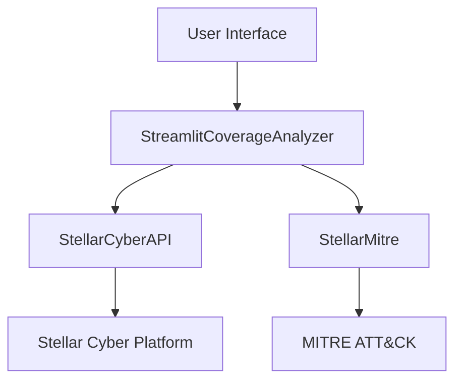

# Coverage Analyzer Documentation

!!! tip "Quick Start"
    1. Download the pre-built executable from our [GitHub Releases page](https://github.com/stellarcyber/detection_coverage_app/releases)
    2. Install and run:
       ```bash
       # macOS: Use the .pkg installer
       # Windows/Linux: Move executable and library to desired location, then add or symlink to PATH.

       # Run the application:
       coverage-analyzer

       # For headless environments (e.g., servers):
       coverage-analyzer --headless
       ```

## Overview

The Coverage Analyzer is a Streamlit-based dashboard application that provides comprehensive analysis of security coverage using the Stellar Cyber API and MITRE ATT&CK framework. The application helps security teams understand their current detection coverage and simulate potential improvements through additional data sources.

## Installation Options

1. **Pre-built Executables (Recommended)**
      - Fastest way to get started
      - No Python environment needed
      - Available for macOS (native installer), Windows and Linux (amd64)

2. **Docker Container**
      - Platform independent
      - Supports both arm64 and amd64
      - Ideal for cloud deployments

3. **Python Package**
      - For development and customization
      - Requires Python 3.10+
      - Can be installed locally with pip or Poetry

See the [Installation Guide](installation.md) for detailed instructions.

## Key Features

Feature | Description
---|---
Real-time Analysis | Live coverage analysis with automatic updates
Interactive Visualizations | Dynamic charts and graphs for data exploration
Data Source Recommendations | Smart suggestions for improving coverage
Performance Metrics | Detailed performance and efficiency tracking
MITRE ATT&CK Integration | Complete framework integration with mapping
Multi-tenant Support | Support for multiple tenant environments
Headless Mode | Support for non-GUI environments

## Architecture



### Core Components

Component | Description
---|---
[StellarCyberAPI](stellarcyberapi.md) | Handles all Stellar Cyber API interactions
[StellarMitre](stellarmitre.md) | Manages MITRE ATT&CK framework integration
[StreamlitCoverageAnalyzer](streamlitcoverageanalyzer.md) | Core application logic and analysis
UI Components | Dashboard layout and interactive elements

## Performance Features

Feature | Description
---|---
Data Processing | Efficient Polars-based data manipulation
Caching | Multi-level caching strategy
Visualization | Optimized Plotly configurations
Memory Management | Smart resource allocation and cleanup

## Security Features

Feature | Description
---|---
Authentication | Secure API key and token management
Data Protection | SSL verification and encryption
Access Control | Role-based access control
Monitoring | Comprehensive security logging

## Getting Started

1. Download and install the executable for your platform from the [GitHub Releases page](https://github.com/stellarcyber/detection_coverage_app/releases)

2. Run the application:
    ```bash
    coverage-analyzer
    ```
    For headless environments:
    ```bash
    coverage-analyzer --headless
    ```

3. Configure your Stellar Cyber credentials in the UI

## Configuration

### Environment Variables

Variable | Description | Required
---|---|---
`STCA_COOKIES_PASSWORD` | Cookie encryption password | No

## Development

1. Clone the repository:
    ```bash
    git clone https://github.com/yourusername/coverage-analyzer.git
    ```

2. Install dependencies:
    ```bash
    poetry install
    ```

3. Run tests:
    ```bash
    poetry run pytest
    ```

## Contributing

1. Fork the repository
2. Create a feature branch
3. Make your changes
4. Submit a pull request

